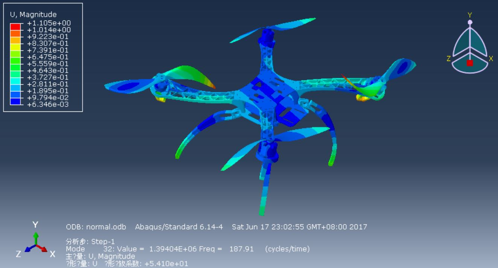
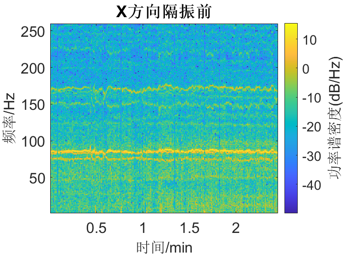

# 多旋翼飞行器振动解决方案

### 介绍
本开源库来自论文《多旋翼飞行器振动机理分析和减振设计》，为了便于相关领域科研人员和工程师使用和完善本文提出的振动解决方案，特将实验测量所需硬件、单片机程序及实验数据、数据处理程序和滤波器程序进行开源。
 
 
### 系统架构
#### 硬件通信架构
 

#### 软件架构
- Arduino:  data_collecting.ino
    - 处理遥控接收机的PWM数据（数据采集开关）
    - 采集MPU6050数据
    - 采集测速仪数据
    - 将数据写入SD卡
    - 串口输出数据采集状态
- Matlab:   
    使用Matlab R2019a完成数据处理
    1. 原始数据
    2. data_processing.mlx
        - 读取数据
        - 重采样
        - 分析振动强度
        - 分析转速稳定性
        - 绘制频谱
        - 绘制时频图
    3. 带阻滤波器文件和陷波器文件
        - bandstop.fda
        - notch.fda

#### 硬件清单
- DJI F450四旋翼无人机
- APM飞行器控制器
- Arduino Mega 2560单片机
- MPU6050惯性测量单元
- 无刷电调测速仪
- 无线透明传输模块
- SD卡及SD卡模块

#### 无人机SolidWorks 3D模型
#### 模态云图（1~50阶）
#### 参与贡献

1.  Fork 本仓库
2.  新建 Feat_xxx 分支
3.  提交代码
4.  新建 Pull Request
